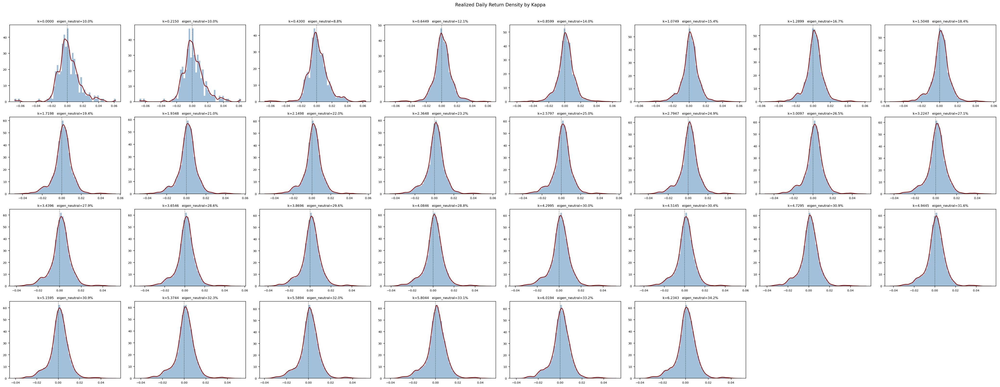

* NO AI WAS USED and everthing here is  my sole understanding  so mistakes may be there ,if u found one i am very happy to know and change if it is wrong .

when i performed monte carlo simulation of the realised returns of a portfolio with given k i realized as everything in this paper A practical guide to robust portfolio optimization is symmetric so changing k wont give me skewed RETURNS ehich i need so that i would get the P(returns>0) >0.5 or skweness of returns <0 ,

when i was thinking on ideas on how to make skewness<0 wjile searching research papers i found these two PUBLISHED PAPERS :

1)Robust Multi-period Portfolio Selection Based on Downside Risk with Asymmetrically Distributed Uncertainty Set
by Aifan Ling1∗, Jie Sun2† Meihua Wang3‡ (DEC 2018)

2)Portfolio Size, Portfolio Composition, and the Skewness of Returns by M. Martin Boyer† Thomas J. Boyer‡ Anthony Sanford (
Initial draft: May 2022 This draft: March 2, 2026)

core ideas i understand about papers as of now(sep 8 2026)-

of 1)

A)REABALANCING OF A PORTFOLIO IS IMPORTANT BECAUSE IF WE HAVE ACHEIEVE THE EXPECTATIONS THEN THE WEIGHT OF THE +VE RETURN ASSET WILL  BE INCREASED IF REALITY IS AGAINST EXPECTATION  THEN WE NEED TO ALLOCATE WEIGHTS AS PER THE CURRENT ESTIMATES. 

B)TRANSACTIONAL COSTS SHOULD BE INVOLVED IN THE OPTIMIZATION PROBLEM.

C)THE RALLIES HAPPEN WITH LESS PROBABILITY THAN  CRASHES IN THE MARKET SO WE NEED TO BE PROTECTED FROM THE UNCERTAINITY REGION OF RETURNS WHICH IS ASSYMMETRIC.

D)AN INVESTOR WONT STOP THE PROFITS WHICH ARE MORE THAN WHAT HE EXPECTED SO WE NEED TO USE ASSYMMETRIC PENALTY NOT VARIANCE AS LIKE IN MARKOWITZ MODEL OR MODEL IN PAPER  A practical guide to robust portfolio optimization.

OF 2)

A) FOR ENOUGH LARGE SIZE OF PORTFOLIO EVEN TOUGH  THE ASSETS INVOLVED IN THE PORTFOLIO HAS + VE SKEWD RETURNS THE INDEX OF THE PORTFOLIO MAY GET -VE SKEWD RERTUNS .

B)SKEWNESS OF A PORTFOLIO IS A FUNCTION OF SIZE OF THE PORTFOLIO.

Now i am going to do tasks as mention below in order :

1)understanding  Paper 1 -> 2)implement it in step by step manner  ->3)compare it with results of (no balancing ,no transactional cost Robust PO,Markowitz model)->4)explaining results->5)understanding 2nd paper -> 6)implenting 2nd paper step by step ->7) adding this to 1st paper ->8) results explanation ->9) performing trading with real money (500 rs 🥶) from my pocket money based on the results i say .

1-1-1-1-1-1-1-1-1-1-1-1-1-1-1-1-1-1-1-1-1-1-1-1-1-1-1-1-1-1-1-1-1-1-1-1-1-1-1-1-1-1-1-1-1-1-1-1-1-1-1-1-1-1-1-1-1-1-1-1.

A PORTFOLIO MANAGER TASK IS TO MANAGE WEALTH OF THE CLIENT 

LET US SAY I START WITH WEALTH (W) AND I WANTED TO MANAGE WEALTH THEN MY ONLY ONLY AIM WOULD BE :

(1)GET MAXIMUM PROFIT POSSIBLE.

But in market there no such thing as you invest money and get profit without any risk if you get then that is infaltion -if u think like u gained money without risk then u are cooked like many indians comparing themselves to their parents who earned less in numbers and thinking they got better.

 so we need to take a level of risk for a respective level of profit that we need to get .

 so  (1) evolved into -get maximum wealth  and realize less losses or negative deviations from expected.

 so my objective would be :

 max(E(wealth)-LPM(target wealth -real wealth ) which is equivalent to (min(-E(returns)+LPM(target wealth -real wealth))->matimatically solvable with CVX in MATLAB.

 Our wealth evolves based on OUr decison based on expectation  and the error of our expectation form the true value

 so let W=g(x,ξe)
 x- decision vector x ∈ X ⊆ Rn
 random vector ξe ∈ Rm where Denote
the joint distribution function of ξe by F  and F is only known to belong to an uncertainty set.

if target is a .

the the objective function becomes 

objective=min(-E(g(x,ξe)+(risk aversion constant)(LPM(a-g(x,ξe))).

with some stochastic constraint let the stochastic constraint be G(x,ξe)>=0.

so we need to obtain a desicion vector such that it staisfies objective function and under constaint

but all x cannot satisfy the constaint  for all values of ξe so we will find and  x which satisfies the objective function for ξe which lies in an uncertainity set(ξ ∈ UΩ)  such that P{(G(x,ξ))≥0}>func(Ω),
we would like if fun(Ω) nearly equal to 1.

NOW TASK IS TO FIND AND UNCERTAINITY SET WHICH IS NOT TOO CONSERVATIVE LIKE IT IN   A practical guide to robust portfolio optimization paper which assumes P(+ ve dviations)=P(-ve deviations).

the uncertainity set should be decided by the the retuns distrubution of the set by treating + ve deviations and -ve deviations sepaerately 

NOTE :seperately above is not differently.

